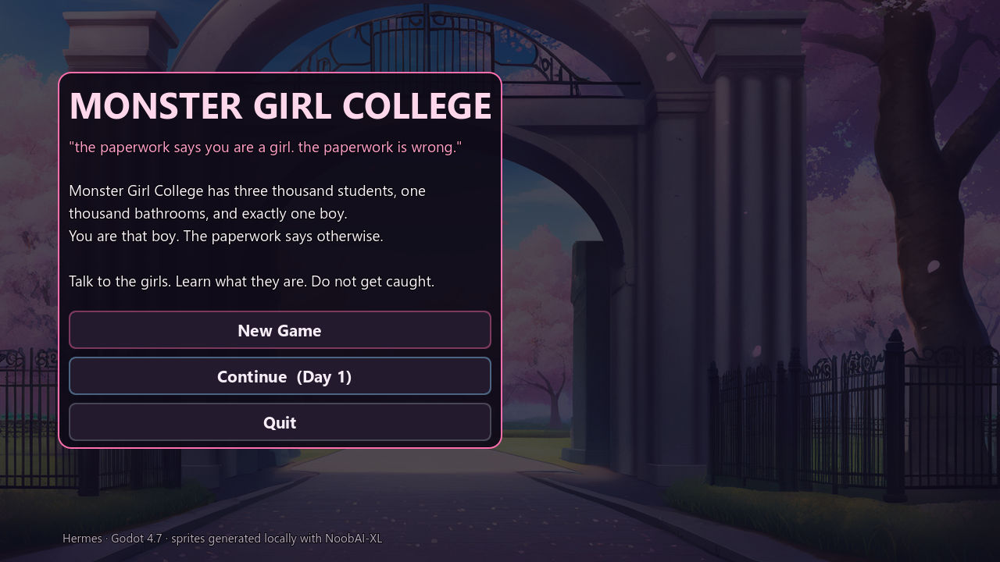
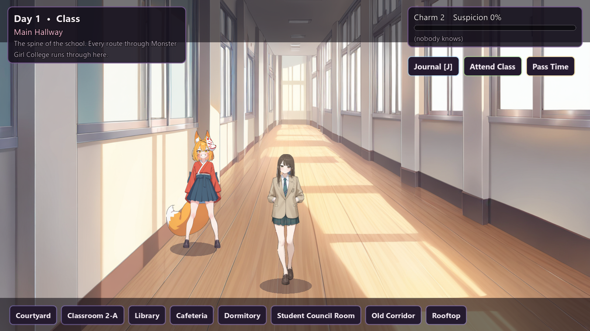
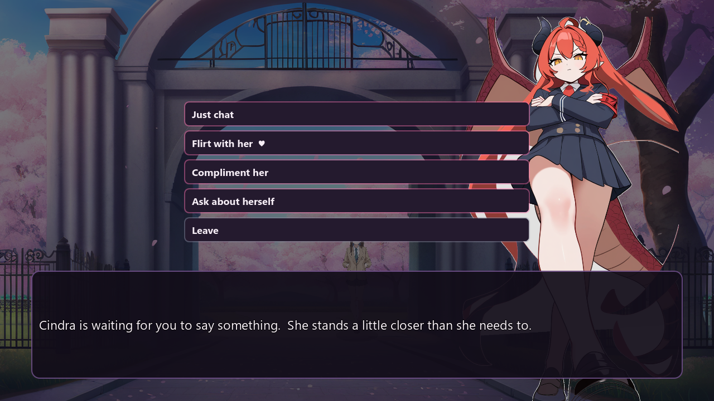
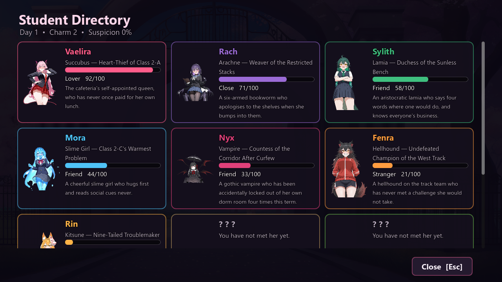
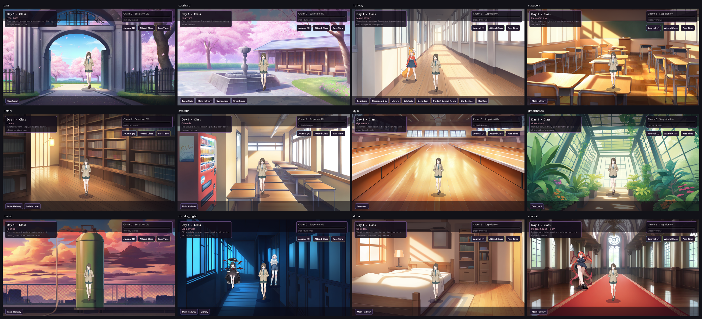

# Monster Girl College

A playable visual-novel / walk-around dating sim built in **Godot 4.7**.

You are the only boy at an all-monster-girl college. A clerical mix-up let you in
because the interviewer took one look at your face and stopped reading the form.
Now the girls are working it out, one conversation at a time.

---

## Screenshots

| | |
|---|---|
|  |  |
|  |  |



## Running it

Open `project.godot` in Godot 4.7 and press F5, or from a shell:

```
"C:/Program Files (x86)/Steam/steamapps/common/Godot Engine/godot.windows.opt.tools.64.exe" \
  --path "C:/Users/Benji/Documents/shitty-ai-game"
```

## Controls

| Input | Action |
|---|---|
| `W A S D` / arrows | walk around |
| `E` / `Space` / `Enter` / left click | talk, advance dialogue |
| click a girl | talk to her |
| click a choice | pick a topic or reply |
| hold `Ctrl` | fast-forward text |
| `J` / `Tab` | student directory |
| `Esc` | close the directory / advance |
| `F11` / `Alt+Enter` | toggle fullscreen |

## The loop

1. Walk around one of 12 areas. Walking **into** a girl you have never met
   triggers her first-meeting scene — that is the premise of the game, so it is
   proximity-based rather than a menu.
2. Talking opens a topic menu: *Just chat*, *Flirt with her*, *Compliment her*,
   *Ask about herself*, *Leave*. Every topic is a **roll** whose odds improve
   as she warms up — success, a neutral fizzle, or (for the risky ones) a
   failure that costs suspicion. Each exchange is a short scripted
   back-and-forth: the boy opens with one of his tier-appropriate lines and she
   answers according to how the roll landed.
3. **Affection** climbs 0→100 across four tiers — Stranger (0), Friend (30),
   Close (60), Lover (85). Higher tiers raise your odds but never guarantee a
   success, so flirting and compliments can still fail at Lover. Crossing a
   threshold queues a bespoke **milestone event** that plays on your next
   conversation with her. The 85 event is her route ending.
4. **Suspicion** rises when a risky roll lands badly. Hit 100 and the enrolment
   form gets read out loud in the staff room: game over. It decays a little
   every night — gossip goes stale.
5. The **conversation budget** refreshes to 25 tokens at the start of every
   period. Just chat costs 1, Flirt costs 3, Compliment costs 2; *Ask about
   herself* is free but once per day per girl. When tokens run out you can only
   leave.
6. The clock runs Morning → Class → Lunch → Afternoon → Evening. *Pass Time*
   advances it, *Attend Class* costs a period and buys Charm, *Go to Sleep* ends
   the day.
7. Progress autosaves on travel, on first meetings, and on milestones. There is
   also a save/load round trip from the title screen.

## The cast

12 students, hundreds of dialogue lines plus 36 milestone events, written per
character with distinct voices:

| Name | Species | Title | Usually found |
|---|---|---|---|
| Vilma | Ghost | The Girl Who Died Mid-Prank | Old Corridor |
| Moira | Slime Girl | Class 2-C's Warmest Puddle | Dormitory |
| Nyra | Wolf Girl | Alpha of the West Track | Gymnasium |
| Krista | Goth Vampire | Countess of the Shaded Corridor | Old Corridor |
| Honkers | Evil Clown | The Laugh of the Lunch Queue | Cafeteria |
| Squidney | Kraken Girl | The Fountain's Problem | Courtyard |
| Rachnia | Spider Girl | Curator of the Corner Webs | Library |
| Zorp | Alien | The Girl From Somewhere Else | Rooftop |
| Kealoha | Shark Girl | Apex of the Cafeteria | Cafeteria |
| Valerie | Demon | The Devil's in the Details | Student Council Room |
| Asteria | Minotaur | Two Tonnes of Gentleness | Gymnasium |
| Emilia | Succubus | The Dream-Weaver of the Dusk Wing | Main Hallway |

Each has `active_periods`, so the school repopulates as the day goes on.

## Layout

```
data/            cast_a.json, cast_b.json (characters), areas.json (map)
scripts/
  autoload/      game.gd (clock, stats, saves), cast.gd (roster + scheduling)
  world/         world.gd (walk-around), actor.gd (sprite + shadow + bob)
  ui/            dialogue.gd, hud.gd, title.gd, journal.gd
  ui_kit.gd      shared look: panels, buttons, bars, fonts
  main.gd        orchestrator; also hosts --selftest / --playtest
main.tscn        single root node; every other node is built in code
assets/
  sprites/       background-keyed full-body art (overworld + VN)
  busts/         head-and-shoulders crops for the directory
  backgrounds/   12 painted areas at 1280x720
  fonts/         Segoe UI
tools/           asset pipeline + screenshots (ignored by Godot via .gdignore)
```

All UI is constructed in GDScript rather than `.tscn` files, so there is no
hand-authored scene tree to go stale.

## Tests

Two suites, both headless, both exit non-zero on failure:

```
# several hundred checks: JSON schema, art presence, tier boundaries, roll-outcome
# buckets, player lines, area link symmetry, NPC scheduling, affection/suspicion
# clamping, token budget, ask-once/day, milestone ordering, save round trip
godot --headless --path . -- --selftest

# 20 checks: drives the real UI - opens scenes, presses the actual choice
# buttons, spends tokens, travels, opens the journal, advances the clock, gets caught
godot --headless --path . -- --playtest
```

Other dev hooks: `--auto=world|new|continue`, `--scene=area:hallway`,
`--scene=meet:vilma`, `--scene=menu:emilia`, `--scene=journal:demo`,
`--scene=ending:asteria`, `--scene=gameover:0`, `--autoplay=1.5`,
`--shot=out.png --shot-delay=3`.

## Regenerating the art

Art is generated locally with NoobAI-XL v1.1 through ComfyUI — no external
services, no moderation layer.

```
python tools/gen_assets.py                  # everything
python tools/gen_assets.py cindra player    # just these two
python tools/rekey.py                       # cut the characters out
python tools/rekey.py rach willa            # just these two
```

### Cutting the characters out

`tools/rekey.py` runs the render through `rembg` with the **`isnet-anime`**
segmentation model — a network trained on anime characters — rather than the
border flood fill this project started with. That flood fill deleted any pale,
low-saturation pixel touching the frame edge, which also described pale skin,
white tights, thin anti-aliased limbs and translucent bodies: it erased Rach's
spider legs, Sylith's tail, Nyx's legs, and dissolved Willa down to her clothes.
It is invisible unless you check the silhouette, which is why it shipped.

Three things make the model's output clean:

1. **Square-padded before inference** — the network resizes its input to a fixed
   1024x1024, so a tall render gets squashed and the mask degrades.
2. **Guided-filtered against the image** — the mask returns at lower resolution
   than the image, leaving stepped edges; the filter snaps the alpha to the
   character's real outline.
3. **Defringed** — every partly-transparent edge pixel is recoloured from its
   nearest fully opaque neighbour, so the white plate stops bleeding into a halo.

Each sprite is then **trimmed to its alpha bounding box**. This is not cosmetic:
the game sizes characters by texture height, so any empty margin baked into the
render became a size error — a girl whose art filled her frame rendered visibly
larger than one drawn with more padding, at an identical target height. Trimming
makes texture height equal character height, which is what the scale maths in
`world.gd` assumes. Portrait crops are generated after trimming.

Dependencies live in their own venv so ComfyUI stays clean:

```
python -m venv C:/Users/Benji/models/bg-removal/venv      # needs Python 3.11;
C:/Users/Benji/models/bg-removal/venv/Scripts/pip install rembg onnxruntime
```

`tools/postprocess_assets.py` is the older keying path and is now only useful for
its background handling and contact sheet.

### Sprite scale

Characters are sized by `world._height_at(y)`:

```
height = NEAR_HEIGHT * area.char_scale * lerp(FAR_RATIO, 1.0, (y - walk_top) / (walk_bottom - walk_top))
```

so a girl at the back of a corridor is genuinely smaller than one beside you, and
everybody is resized as they move. `NEAR_HEIGHT` is the height in pixels at the
front edge of the walkable band; `area.char_scale` (in `data/areas.json`) trims
it for backdrops whose implied perspective differs; a cast member's
`height_scale` in the cast JSON is the on-top personal multiplier. With trimming
in place these numbers mean what they say, so tune them here rather than by
eyeballing sprite sizes.

**After regenerating any image you must re-run the Godot import**, or the editor
will keep serving the cached texture:

```
godot --headless --path . --import
```

> VRAM note: the image model and the local LLM cannot both fit on a 12 GB card.
> Stop `llama-server` before generating, and stop ComfyUI before using the LLM.

## Known rough edges

- Backgrounds are rendered at 1216x832. That is fine windowed, but on a 1440p
  screen maximised they are upscaled about 2x and look soft. Re-rendering at
  1920x1080 (or 1536x864) is a `BG_` size change plus a re-run of
  `gen_assets.py`; it has not been done.
- There is no audio.
- Milestone events are single scenes rather than multi-scene arcs.
- `--scene=`/`--shot=`/`--autoplay`/`--selftest`/`--playtest` hooks are dev
  affordances and are live in the shipped build.
